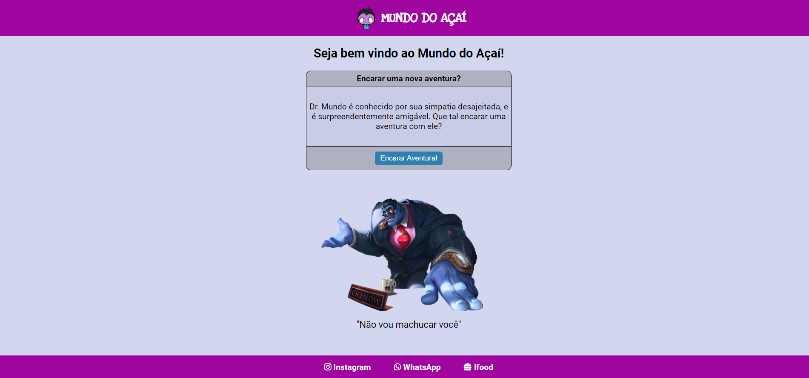
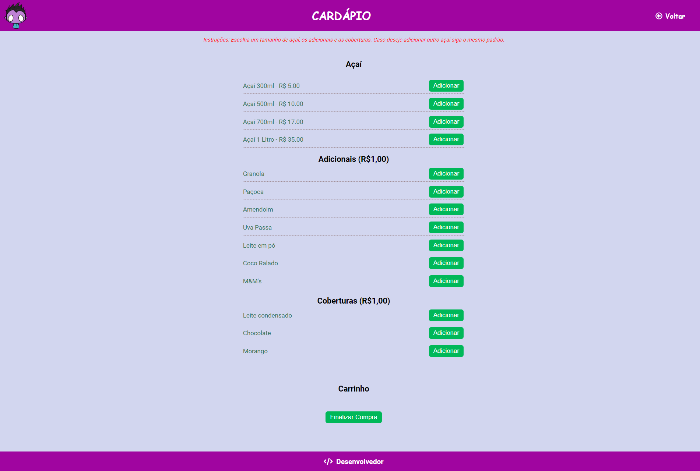

# MUNDO DO AÇAÍ

Projeto criado com o propósito de gerar uma interface simples para totem de uma loja de açaí.

[🔗 Clique aqui para acessar o projeto](https://mateusrodriguees.github.io/mundo-acai/)

## Tecnologias ⚙️ 

- HTML
- CSS
-JS
- Git e Github

## Contato 📱

mateus_ssilvarodrigues@outlook.com

